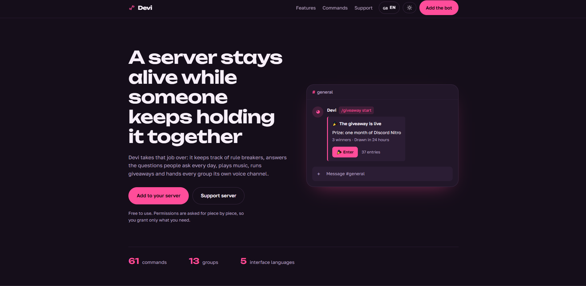
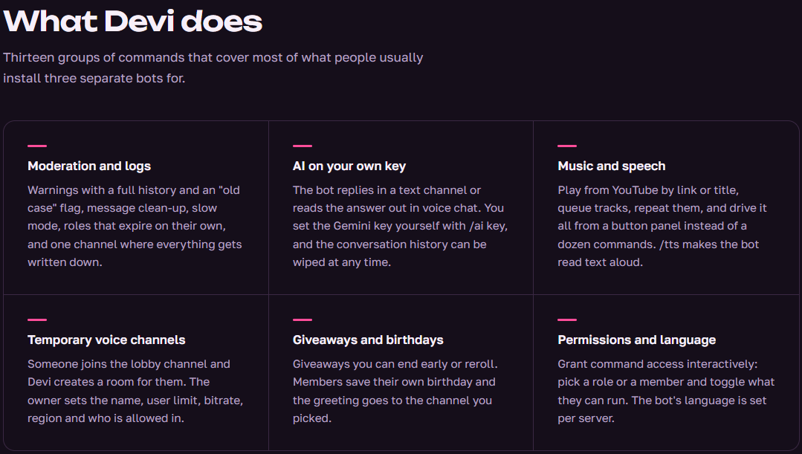
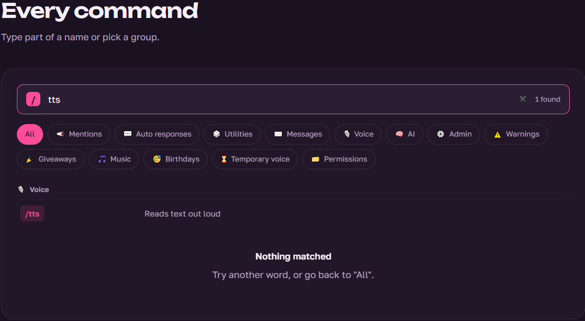
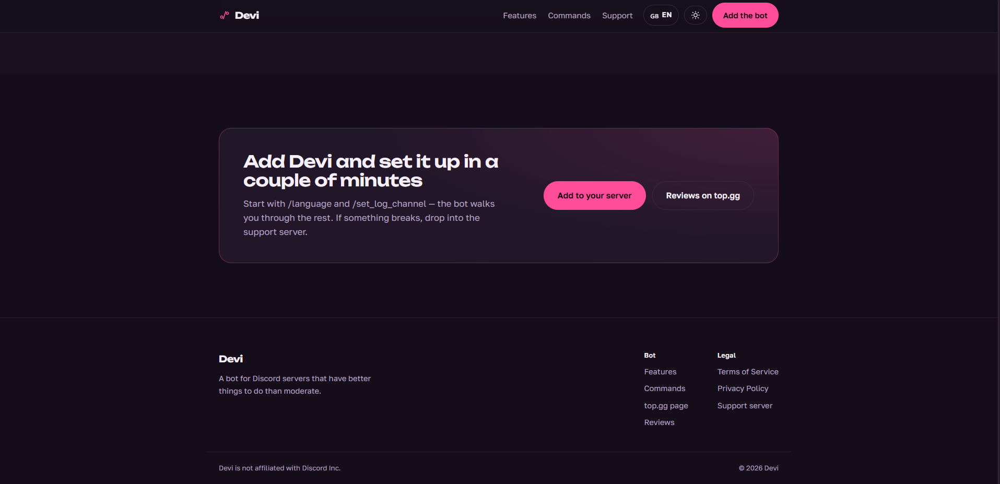

# Devi — Bot Landing Page

A Flask-powered landing page for the [Devi Discord bot](https://github.com/security-camera/Devi-Discord-Bot), featuring dark and light themes,
a pink accent color, and built-in language switching; additional languages can be added by creating a single JSON file.

<table>
  <tr>
    <th>Site</th>
    <th>Features</th>
  </tr>
  <tr>
    <td align="center">
      
    </td>
    <td align="center">
      
    </td>
  </tr>
  <tr>
    <th>Commands</th>
    <th>Outro</th>
  </tr>
  <tr>
    <td align="center">
      
    </td>
    <td align="center">
      
    </td>
  </tr>
</table>

## Getting Started

```bash
pip install -r requirements.txt
python app.py
# http://127.0.0.1:5000
```

## Project Structure

```text
app.py             Flask routes
i18n.py            Translation engine: file discovery, fallback, and language selection
data.py            Commands, sections, and links (no user-facing text)
locales/           Site locales
templates/         base.html, index.html, 404.html
static/css, js/    Stylesheets and JavaScript
build_static.py    Builds a single self-contained HTML file
```

## Adding a Language

1. Copy `locales/en.json` to `locales/<code>.json` (for example, `de.json`).
2. Translate the values. The `_meta` block defines the information displayed in the
   language switcher:

```
"_meta": {
    "name": "Deutsch",
    "english_name": "German",
    "short": "DE",
    "flag": "🇩🇪",
    "dir": "ltr"
}
```

3. Restart the server. The new language will automatically appear in the language
   menu, at `/de/`, and in the `/api/locales` JSON response. No code changes are required.

Missing translation keys automatically fall back to the default language
(`i18n.DEFAULT_LANG`, currently `ru`), allowing translations to be completed incrementally.

For right-to-left languages, set `"dir": "rtl"`. This value is automatically applied
to the `<html>` element.

## Language Selection

Languages are selected in the following order:

```text
URL (/en/) → devi_lang cookie → Accept-Language header → DEFAULT_LANG
```

All translations are included in the page, so switching languages from the menu is
instant and does not require a page reload. The URL is updated using the History API.

If JavaScript is disabled, the language switcher falls back to the standard server-side
route.

## Themes

The selected theme is stored in `localStorage` under the `devi-theme` key and applied
before the first render, preventing a flash of the wrong theme during page load.

If no theme has been saved, the system's preferred color scheme is used.

Theme colors are defined as CSS variables at the beginning of `style.css`.
Each theme has its own `--accent` / `--accent-strong` pair.

## Text and Commands

The command list is defined in `data.COMMAND_GROUPS`. Each entry contains the section ID,
icon, and a pair consisting of the translation key and the command users enter in Discord.

Command descriptions are stored in the locale files under `cmd.<key>`.

To add a new command:

1. Add its translation key and Discord command to the appropriate section in
   `data.COMMAND_GROUPS`.
2. Add the corresponding translated string to every locale file.

Links such as the bot invite, support server, Terms of Service, Privacy Policy, and
top.gg page are defined in `data.LINKS`.

## Static Build

```bash
python build_static.py            # dist/index.html
python build_static.py out.html
```

This generates a single self-contained HTML file with:

* CSS and JavaScript embedded directly into the page
* All available translations included
* No server required at runtime

The generated file can be opened directly from disk or deployed to any static hosting
provider, such as GitHub Pages or Cloudflare Pages.

Server-side language detection via `Accept-Language` is not available in the static build.
Users can switch languages manually.

## Deployment

The application can be run using any standard WSGI server. For example, with Gunicorn:

```bash
pip install gunicorn
gunicorn -w 2 -b 0.0.0.0:8000 app:app
```
