# Devi — Website and Dashboard

A Flask-powered website for the [Devi Discord bot](https://github.com/security-camera/Devi-Discord-Bot). It consists of two parts:

* **Landing page** with dark and light themes, a pink accent color, and built-in language switching.
  Additional languages can be added by creating a single JSON file.
* **Dashboard** (optional): sign in with Discord and configure Devi on your servers from the browser
  instead of slash commands. It stays switched off until it is configured, so the landing page works
  on a machine that has no dashboard setup.


## Landing images
<table>
  <tr>
    <th>Site</th>
    <th>Features</th>
  </tr>
  <tr>
    <td align="center">
      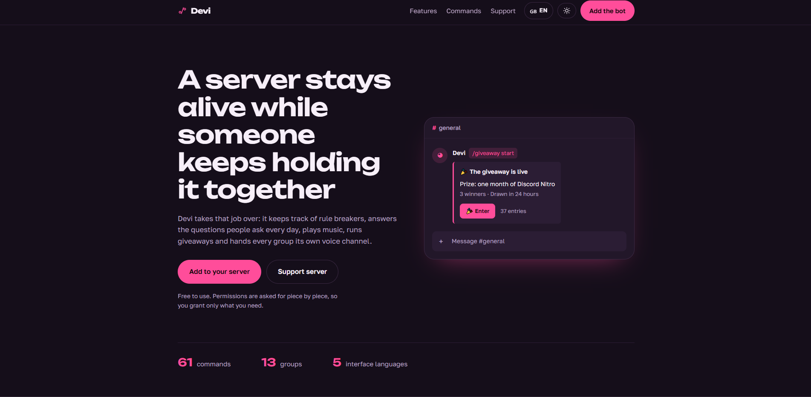
    </td>
    <td align="center">
      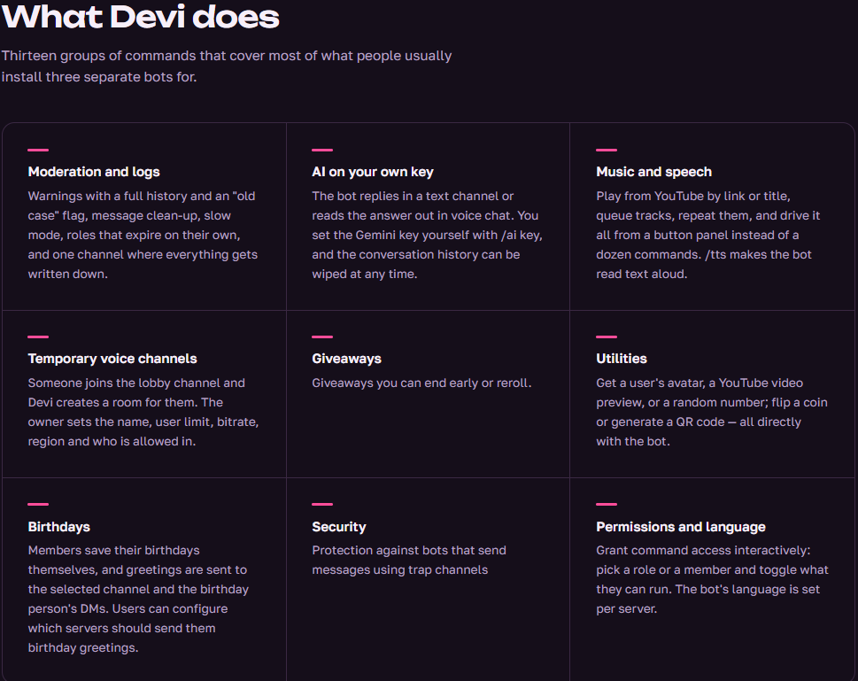
    </td>
  </tr>
  <tr>
    <th>Commands</th>
    <th>Outro</th>
  </tr>
  <tr>
    <td align="center">
      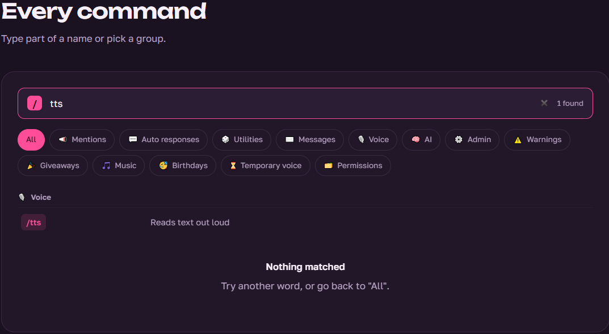
    </td>
    <td align="center">
      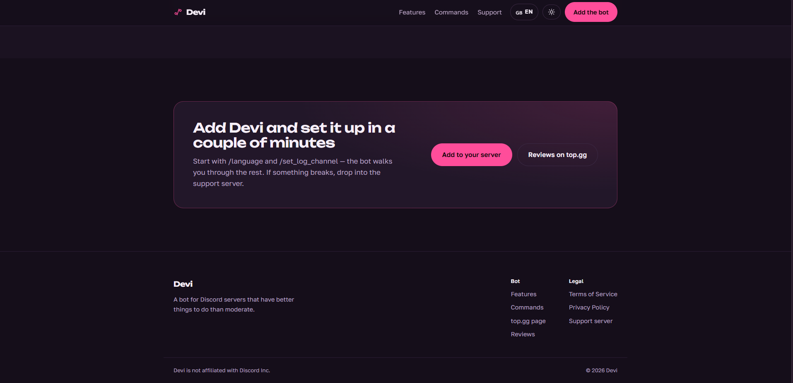
    </td>
  </tr>
</table>

## Dashboard images

<table>
  <tr>
    <th>Servers</th>
    <th>Permissions</th>
  </tr>
  <tr>
    <td align="center">
      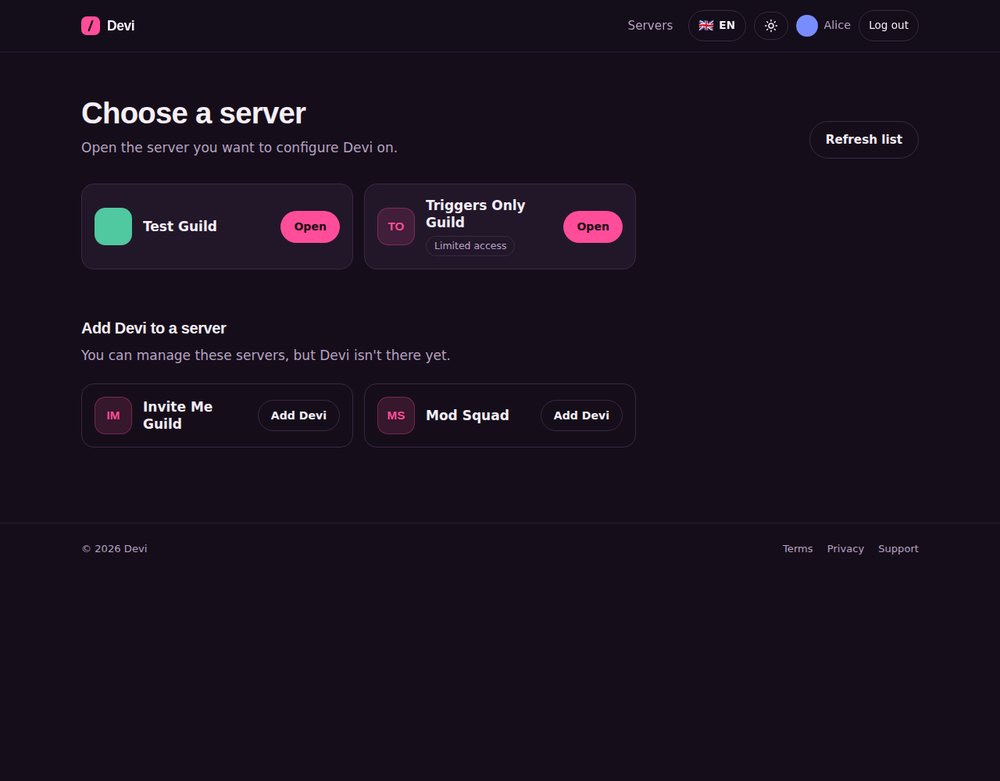
    </td>
    <td align="center">
      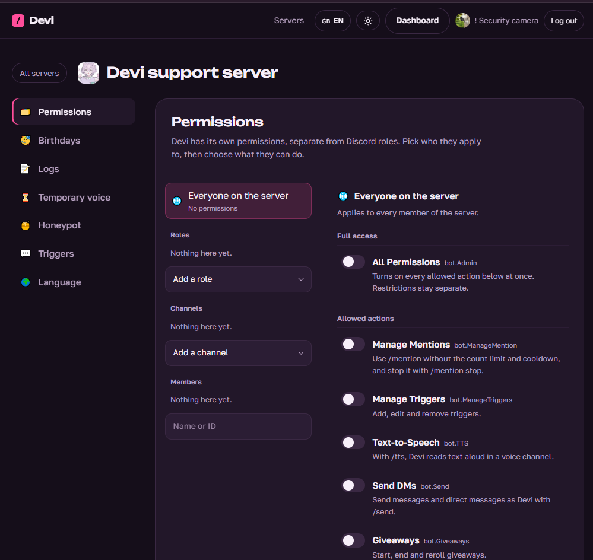
    </td>
  </tr>
  <tr>
    <th>Birthdays</th>
    <th>Logs</th>
  </tr>
  <tr>
    <td align="center">
      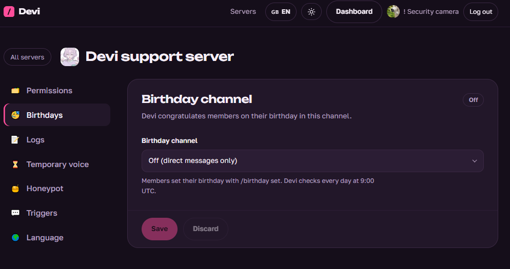
    </td>
    <td align="center">
      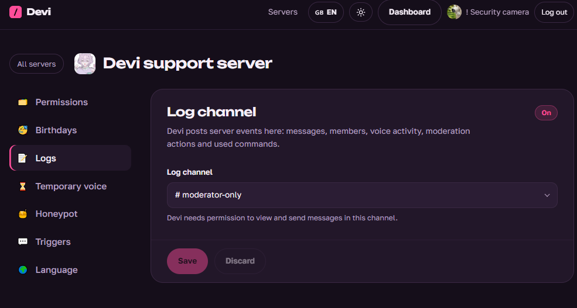
    </td>
  </tr>
  <tr>
    <th>Voices</th>
    <th>Honeypots</th>
  </tr>
  <tr>
    <td align="center">
      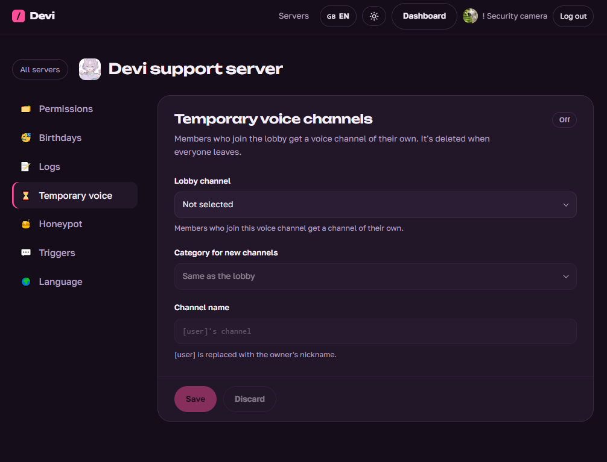
    </td>
    <td align="center">
      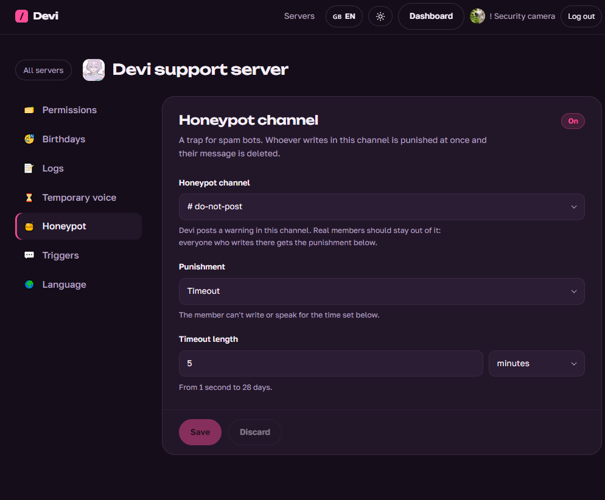
    </td>
  </tr>
  <tr>
    <th>Triggers</th>
    <th>Languages</th>
  </tr>
  <tr>
    <td align="center">
      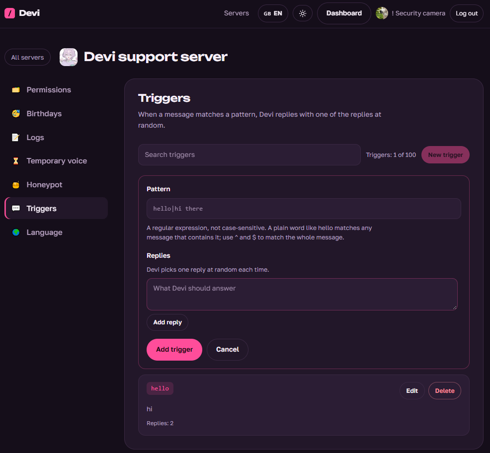
    </td>
    <td align="center">
      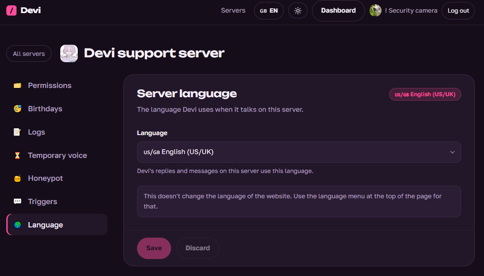
    </td>
  </tr>
</table>

## Getting Started

```bash
pip install -r requirements.txt
python app.py
# http://127.0.0.1:5000
```

`python app.py` runs Flask's development server (debug mode is on unless `FLASK_DEBUG=0`).
For production use a WSGI server, see [Deployment](#deployment).

This starts the landing page. To turn the dashboard on, follow [Dashboard → Setup](#setup).

## Dashboard

### What it does

After signing in with Discord, the **Servers** page lists the servers where Devi is present and where you are
allowed to change something. Servers you manage but where Devi is missing get an *Add Devi* button.
Each server has these sections:

| Section         | What you can set                                                                                                | Who can open it                                     |
|-----------------|-----------------------------------------------------------------------------------------------------------------|-----------------------------------------------------|
| Permissions     | Which roles and members get which of Devi's permissions (the same as `/permissions manage`)                     | Administrator or Devi's `Admin` permission          |
| Birthdays       | The channel birthdays are announced in                                                                          | Administrator or Devi's `Admin` permission          |
| Logs            | The channel Devi writes its logs to                                                                             | Administrator or Devi's `Admin` permission          |
| Temporary voice | Lobby channel, category and name template of temporary voice channels                                           | Administrator or Devi's `Admin` permission          |
| Honeypot        | The honeypot channel and the punishment for writing in it: timeout, ban / kick, or a role, each with a duration | Administrator or Devi's `Admin` permission          |
| Triggers        | Automatic replies                                                                                               | Administrator or Devi's `ManageTriggers` permission |
| Language        | The language Devi uses on the server (not the language of this website)                                         | Administrator or Devi's `Admin` permission          |

The rules mirror the slash commands. Someone who may not run a command in Discord cannot change the same setting
here, and sections a person may not use are not shown to them.

### How it works

```text
browser  ──►  this site (Flask)  ──►  the bot's internal HTTP API (aiohttp, cogs/dashboard_api.py)
          session cookie             Bearer token + the signed-in user's Discord id
```

* The site only authenticates people (Discord OAuth2) and forwards their requests. Settings live in the bot.
* On **every** request the bot checks again what that user may do on that server, so a stale server list
  or a leftover session can never grant access.
* The bot API listens on `127.0.0.1:8765` by default and must not be exposed to the internet. Only the site
  knows its token.

### Setup

1. **Discord Developer Portal** → your application → *OAuth2*: add the redirect
   `https://<your-domain>/oauth/callback` and copy the *Client Secret*.
2. **Bot** (`config/.env`): set `DASHBOARD_API_TOKEN` to a random string of 24+ characters.
   Optionally set `DASHBOARD_API_HOST` and `DASHBOARD_API_PORT` (defaults `127.0.0.1` and `8765`).
   Restart the bot.
3. **Site**: copy `env_example.env` to `.env` next to `app.py` and fill it in (see the table below).
   Restart the site.

When the client secret or the token is missing, the dashboard buttons are hidden and the dashboard routes
answer with a "not configured" page. Nothing else on the site is affected.

| Variable                | Required      | Meaning                                                                                                                                                                                                       |
|-------------------------|---------------|---------------------------------------------------------------------------------------------------------------------------------------------------------------------------------------------------------------|
| `DISCORD_CLIENT_SECRET` | yes           | OAuth2 client secret from the Developer Portal                                                                                                                                                                |
| `DISCORD_REDIRECT_URI`  | in production | Exactly the redirect added in the portal, e.g. `https://example.org/oauth/callback`. Behind a reverse proxy Flask cannot guess it. An `https://` value also turns on the `Secure` flag of the session cookie. |
| `BOT_API_TOKEN`         | yes           | The same value as `DASHBOARD_API_TOKEN` in the bot                                                                                                                                                            |
| `BOT_API_URL`           | no            | Where the bot API is, default `http://127.0.0.1:8765`                                                                                                                                                         |
| `DISCORD_CLIENT_ID`     | no            | Default: taken from the invite link in `data.py`                                                                                                                                                              |
| `SECRET_KEY`            | no            | Signs the session cookie. Default: generated once into `instance/secret_key`                                                                                                                                  |
| `DEVI_SESSION_DAYS`     | no            | How many days a session lives after its last use, default `7`                                                                                                                                                 |
| `DEVI_SESSION_DB`       | no            | Default `instance/sessions.sqlite3`                                                                                                                                                                           |
| `DEVI_LOG_LEVEL`        | no            | Default `INFO`: sign-ins and the reason a session was rejected are logged                                                                                                                                     |

### Sign-in and sessions

* The site asks Discord for the `identify` and `guilds` scopes only, which are read-only: your name, avatar and
  the list of your servers.
* The first request is sent with `prompt=none`: if you have already authorized Devi, Discord sends you straight
  back without any screen. If not, you see the usual *Authorize* screen once.
* The Discord access token is used for three calls during sign-in and then thrown away. It is never stored.
  It is deliberately **not revoked** either: for Discord, revoking a token also withdraws the authorization, and
  the *Authorize* screen would come back on every sign-in.
* A session is stored on the server in `instance/sessions.sqlite3`: the user's id, name and avatar, and the
  server list. The session id is a random value that is stored only as a hash. The browser gets a signed,
  `HttpOnly`, `SameSite=Lax` cookie (`devi_session`) with that id.
* Sessions **slide**: every visit starts the countdown again, so you stay signed in for as long as you use the
  dashboard and are asked again only after `DEVI_SESSION_DAYS` without a visit.
* Signing in on another device or browser does not end the other sessions. An account keeps up to 10 of them,
  the least recently used one goes first. *Sign out* ends only the current session.
* Writes need the session's CSRF token (`X-CSRF-Token`). Dashboard pages are served with `Cache-Control: no-store`,
  a nonce-based Content-Security-Policy, `X-Frame-Options: DENY` and `X-Content-Type-Options: nosniff`.

### Troubleshooting: asked to sign in again

The dashboard logs why a session was rejected (the service log, e.g. `journalctl -u <your-service>`):

| Log line                           | Meaning                                             | Usual cause                                                                                                                                             |
|------------------------------------|-----------------------------------------------------|---------------------------------------------------------------------------------------------------------------------------------------------------------|
| `signed in: user …`                | A successful sign-in                                |                                                                                                                                                         |
| `session rejected: unknown`        | The cookie names a session the server does not have | `instance/` or `DEVI_SESSION_DB` was wiped or moved (a deployment that replaces the folder), or the session was the 11th of the account and got dropped |
| `session rejected: expired`        | The session was not used for `DEVI_SESSION_DAYS`    | Normal                                                                                                                                                  |
| `the session cookie is unreadable` | A cookie arrived, but its signature does not match  | `SECRET_KEY` changed, or `instance/secret_key` was deleted                                                                                              |
| nothing is logged                  | The browser does not send the cookie                | Opening the site over `http://` while `DISCORD_REDIRECT_URI` is `https://` (the cookie is `Secure`), or a different domain than the redirect            |

To look at the stored sessions:

```bash
sqlite3 instance/sessions.sqlite3 "select user_id, datetime(expires_at, 'unixepoch') from sessions"
```

### Dashboard API

The page talks to `/api/dashboard/<guild_id>/…` of this site (session cookie, CSRF header on writes), which forwards
to `/v1/guilds/<guild_id>/…` of the bot. The full list is in the bot's README.

| Method | Path                                | Body                                                                             |
|--------|-------------------------------------|----------------------------------------------------------------------------------|
| GET    | `/`                                 | Everything the page needs for one server: sections, settings, channels, roles    |
| PUT    | `/log-channel`, `/birthday-channel` | `{"channel_id": "…" \| null}`                                                    |
| PUT    | `/temp-voice`                       | Lobby channel, category and name template                                        |
| PUT    | `/honeypot`                         | `{"channel_id": "…" \| null, "punishment": 0, "duration": 600, "role_id": null}` |
| PUT    | `/language`                         | `{"locale": "ru"}`                                                               |
| PATCH  | `/permissions`                      | Changes to Devi's permissions                                                    |
| GET    | `/members?q=`                       | Member search for the permission pickers                                         |
| POST   | `/triggers`                         | Create a trigger                                                                 |
| PUT    | `/triggers`                         | Edit a trigger                                                                   |
| POST   | `/triggers/delete`                  | Delete a trigger                                                                 |

Honeypot: `channel_id: null` switches the honeypot off. `punishment` is `0` timeout (1 second to 28 days), `1` ban
(`duration: 0` kicks instead) or `2` role (`role_id` is required, `duration: 0` keeps the role until it is removed).
`duration` is in seconds, 10 years at most. Language: `locale` is one of the bot's languages
(`GET /` lists them under `settings.language.available`).

### Adding a dashboard section

1. **Bot**, `cogs/dashboard_api.py`: add the name to `SECTIONS` (and to `ADMIN_SECTIONS` if it is an admin
   section), put its state into the snapshot and add a handler and a route.
2. **Site**, `dashboard/views.py`: add a route that forwards to the bot, and update `SECTION_COUNT`.
3. **Site**, `static/js/dashboard.js`: add the name to `ORDER`, `ICONS` and `PANELS`, write the panel, and handle
   its state in `initForms` and `isDirty`.
4. **Site**, `locales/dashboard/*.json`: add `sections.<name>`, the strings of the panel and the new error codes
   to every language.

## Project Structure

```text
app.py              Flask routes of the landing page
i18n.py             Translation engine: file discovery, fallback, and language selection
data.py             Commands, sections, and links (no user-facing text)
dashboard/          The dashboard (Flask blueprint)
    __init__.py         Wiring: cookie settings, session store, logging
    settings.py         Configuration read from the environment
    oauth.py            Discord OAuth2
    sessions.py         Server-side sessions in SQLite
    bot_api.py          Client of the bot's internal HTTP API
    views.py            Pages, sign-in routes and the JSON API
locales/            Landing page locales
locales/dashboard/  Dashboard locales (one file per language)
templates/          base.html, index.html, 404.html
templates/dashboard/  Dashboard pages
templates/partials/   Pieces shared with the landing page
static/css, js/     Stylesheets and JavaScript (style.css, main.js, dashboard.css, dashboard.js)
build_static.py     Builds a single self-contained HTML file
instance/           Created at run time: secret key and sessions (keep it, it is not in git)
env_example.env     Template of the .env file
```

## Adding a Language

1. Copy `locales/en.json` to `locales/<code>.json` (for example, `de.json`).
2. Translate the values. The `_meta` block defines the information displayed in the
   language switcher:

```
"_meta": {
    "name": "Deutsch",
    "english_name": "German",
    "short": "DE",
    "flag": "🇩🇪",
    "dir": "ltr"
}
```

3. Optional, for the dashboard: copy `locales/dashboard/en.json` to `locales/dashboard/<code>.json` and translate it.
4. Restart the server. The new language will automatically appear in the language
   menu, at `/de/`, and in the `/api/locales` JSON response. No code changes are required.

Missing translation keys automatically fall back to the default language
(`i18n.DEFAULT_LANG`, currently `en`), allowing translations to be completed incrementally.
This also applies to the dashboard: a language without a dashboard file shows the English dashboard.

For right-to-left languages, set `"dir": "rtl"`. This value is automatically applied
to the `<html>` element.

The language of Devi itself on a server (the **Language** section of the dashboard, or `/language`) is a
separate list: it comes from the bot's own `config/locales`.

## Language Selection

Languages are selected in the following order:

```text
URL (/en/) → devi_lang cookie → Accept-Language header → DEFAULT_LANG
```

All translations are included in the page, so switching languages from the menu is
instant and does not require a page reload. The URL is updated using the History API.

If JavaScript is disabled, the language switcher falls back to the standard server-side
route.

## Themes

The selected theme is stored in `localStorage` under the `devi-theme` key and applied
before the first render, preventing a flash of the wrong theme during page load.

If no theme has been saved, the system's preferred color scheme is used.

Theme colors are defined as CSS variables at the beginning of `style.css`.
Each theme has its own `--accent` / `--accent-strong` pair.

## Text and Commands

The command list is defined in `data.COMMAND_GROUPS`. Each entry contains the section ID,
icon, and a pair consisting of the translation key and the command users enter in Discord.

Command descriptions are stored in the locale files under `cmd.<key>`.

To add a new command:

1. Add its translation key and Discord command to the appropriate section in
   `data.COMMAND_GROUPS`.
2. Add the corresponding translated string to every locale file.

Links such as the bot invite, support server, Terms of Service, Privacy Policy, and
top.gg page are defined in `data.LINKS`.

## Static Build

```bash
python build_static.py            # dist/index.html
python build_static.py out.html
```

This generates a single self-contained HTML file with:

* CSS and JavaScript embedded directly into the page
* All available translations included
* No server required at runtime

The generated file can be opened directly from disk or deployed to any static hosting
provider, such as GitHub Pages or Cloudflare Pages.

Server-side language detection via `Accept-Language` is not available in the static build.
Users can switch languages manually.

The static build is the landing page only. Run it where the dashboard is not configured (no `.env`), otherwise
the top bar gets a *Log in* button that has nothing to talk to on a static host.

## Deployment

The application can be run using any standard WSGI server. For example, with Gunicorn:

```bash
pip install gunicorn
gunicorn -w 2 -b 0.0.0.0:8000 app:app
```

Several workers are fine: they share the session database and the key in `instance/`.

A typical production setup is Gunicorn under systemd behind nginx with HTTPS:

```ini
# /etc/systemd/system/devi-site.service
[Unit]
Description=Devi website
After=network.target

[Service]
WorkingDirectory=/var/www/devi-site
ExecStart=/var/www/devi-site/venv/bin/gunicorn -w 2 -b 127.0.0.1:8000 app:app
Restart=on-failure

[Install]
WantedBy=multi-user.target
```

```nginx
location / {
    proxy_pass http://127.0.0.1:8000;
    proxy_set_header Host $host;
    proxy_set_header X-Forwarded-For $proxy_add_x_forwarded_for;
    proxy_set_header X-Forwarded-Proto $scheme;
}
```

Things worth knowing:

* `.env` is read from the **working directory**, so set `WorkingDirectory` (or `--chdir`) to the project folder.
* `instance/` holds the secret key and the sessions. The service user needs to write there, and it has to survive
  deployments: if it is replaced, everybody has to sign in again.
* Set `DISCORD_REDIRECT_URI` to the public `https://` address and open the site only over HTTPS.
* Keep the bot API (`BOT_API_URL`) on localhost or a private network.
